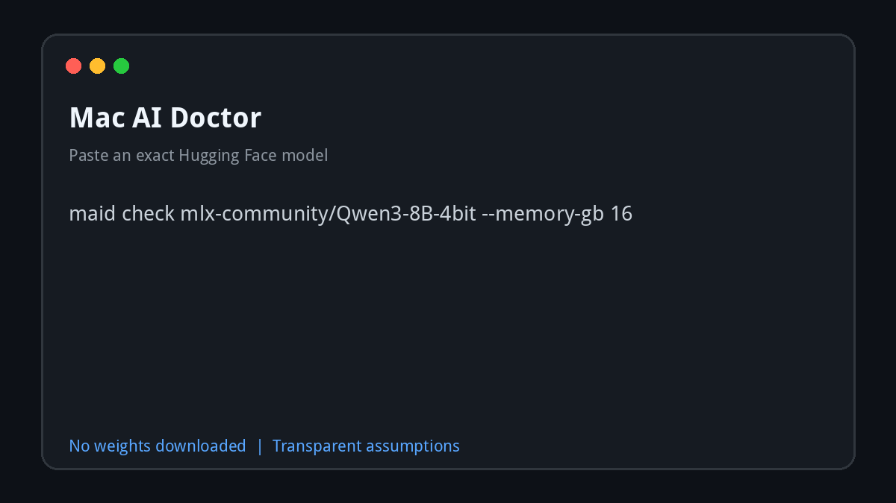

# Mac AI Doctor

**Paste an exact Hugging Face model. Know whether it fits your Apple Silicon Mac before downloading the weights.**

[](https://github.com/barvhaim/mac-ai-doctor/actions/workflows/ci.yml)
[](https://pypi.org/project/mac-ai-doctor/)
[](https://pypi.org/project/mac-ai-doctor/)
[](LICENSE)



Mac AI Doctor (`maid`) reads bounded metadata, never model weights, and estimates weights, KV cache and runtime memory as an honest range. It then returns a plain `COMFORTABLE`, `TIGHT`, `UNLIKELY` or `UNKNOWN` verdict.

## Try it in under a minute

Run once without installing:

```bash
uvx mac-ai-doctor check https://huggingface.co/mlx-community/Qwen3-8B-4bit
```

Or install the CLI:

```bash
pipx install mac-ai-doctor
# or: uv tool install mac-ai-doctor
```

Launch the browser UI locally:

```bash
uvx --with 'mac-ai-doctor[web]' mac-ai-doctor web
```

A hosted demo is the next deployment milestone. Until it is live, the command above starts the same web experience locally without cloning this repository.

## The exact-model workflow

```bash
maid check https://huggingface.co/ibm-granite/granite-switch-4.1-3b-preview --memory-gb 16
```

```text
     ibm-granite/granite-switch-4.1-3b-preview
┌────────────┬────────────────┐
│ Weights    │        8.80 GB │
│ KV cache   │        0.34 GB │
│ Runtime    │        1.31 GB │
│ Peak range │ 11.49-13.06 GB │
│ Available  │        16.0 GB │
└────────────┴────────────────┘
TIGHT - May fit, but close memory-heavy apps or reduce context/concurrency.
```

The web UI accepts reproducible query parameters and lets you download the result as a Markdown report or SVG compatibility badge.

## What makes it different?

Mac AI Doctor is deliberately narrow: inspect one exact model for one Apple Silicon memory budget before a large download.

| Capability | Mac AI Doctor | Static calculators | General hardware recommenders |
| --- | :---: | :---: | :---: |
| Inspect an arbitrary public Hugging Face repository | Yes | Usually no | Varies |
| Accept local MLX/config directories and GGUF files | Yes | No | Varies |
| Download no model weights during a check | Yes | Yes | Varies by operation |
| Show context, concurrency and KV-cache assumptions | Yes | Varies | Varies |
| Produce a transparent memory range | Yes | Varies | Varies |
| Rank hundreds of models or predict tokens/second | No | Sometimes | Often |

If you need broad cross-platform recommendations, runtime management or community performance benchmarks, [`llmfit`](https://github.com/AlexsJones/llmfit) may be a better fit. Mac AI Doctor focuses on transparent, exact-repository screening for Macs.

## More commands

```bash
maid web                                                  # interactive browser UI
maid system                                               # detect your chip and memory
maid check meta-llama/Llama-3.1-8B-Instruct               # Hugging Face ID
maid check ~/Models/model-q4.gguf --context 8192          # local GGUF
maid compare org/model-a org/model-b --concurrency 2      # side-by-side
maid recommend --memory-gb 16 --task coding               # conservative starting class
maid check MODEL --json                                   # machine-readable result
```

Inputs:

- Hugging Face model ID or URL
- Local `.gguf` file
- Local/MLX directory containing `config.json`

Important options: `--memory-gb`, `--context`, `--concurrency`, `--kv-dtype` (`fp32`, `fp16`, `bf16`, `int8`, `q8`) and `--json`.

## Verdicts

| Verdict | Meaning |
| --- | --- |
| **COMFORTABLE** | High estimate uses at most 80% of available memory. |
| **TIGHT** | Estimated to fit with less than 20% headroom. |
| **UNLIKELY** | High estimate exceeds available memory. |
| **UNKNOWN** | Weight-size metadata is unavailable. |

Confidence describes metadata completeness, not prediction accuracy.

## Privacy and bounded reads

Mac AI Doctor reads only:

- `config.json`
- the safetensors index
- the Hugging Face model API's file-size listing
- the 24-byte header of a local GGUF, plus its local file size

**Weight contents are never downloaded. No credentials are collected.** Gated repositories may require your existing Hugging Face authentication.

## How it estimates

Decimal GB. This is screening, not a benchmark.

```text
weights = stored_weight_bytes * 1.06
KV      = 2 * layers * KV_heads * head_dim * context * concurrency * dtype_bytes
runtime = max(1 GB, weights * 12%) + 0.25 GB * concurrency
range   = subtotal * 1.10 .. subtotal * 1.25
```

Unified memory is shared with macOS, applications and the GPU. Memory mapping can help. Multimodal image encoders and runtime-specific allocations may add memory that text configuration metadata does not describe. No tokens-per-second prediction is made.

See the [validation protocol and public results table](docs/validation.md). Please submit real measured runs, especially underestimates, through the validation issue template.

## Troubleshooting

- **Cannot detect memory:** pass `--memory-gb N`; automatic detection requires macOS.
- **401/403 or gated repository:** authenticate with Hugging Face or use a local `config.json`.
- **No weight size:** use a repository exposing safetensors index/API sizes or a local GGUF v2/v3 file.
- **Estimate differs from runtime:** report the measured run using the validation template.

## Contributing

Good contributions include reproducible validation runs, estimator edge cases, architecture metadata support and focused UX improvements. See [CONTRIBUTING.md](CONTRIBUTING.md) and the scoped `good first issue` tickets.

```bash
git clone https://github.com/barvhaim/mac-ai-doctor.git
cd mac-ai-doctor
uv sync --group dev
uv run ruff check .
uv run mypy src
uv run pytest
uv build
```

Launch copy for Show HN, Reddit and LinkedIn lives in [`docs/launch-kit.md`](docs/launch-kit.md). MIT licensed.
